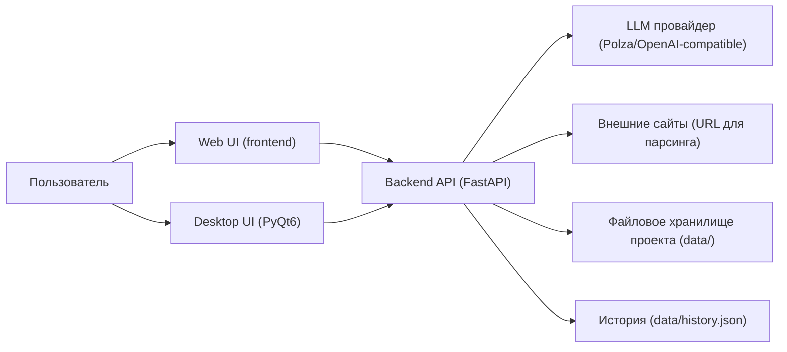
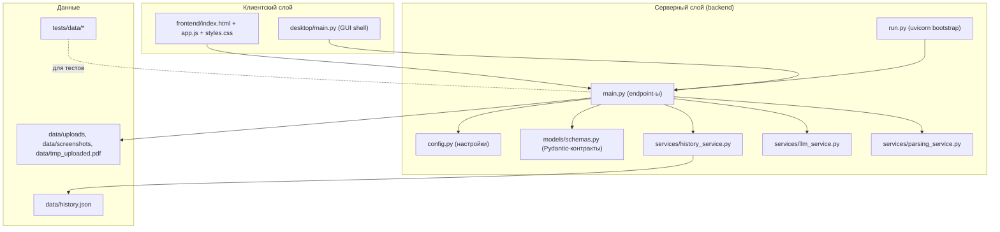
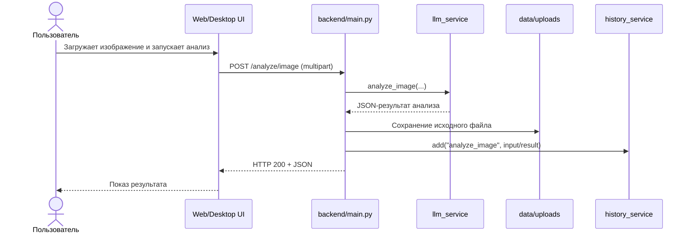
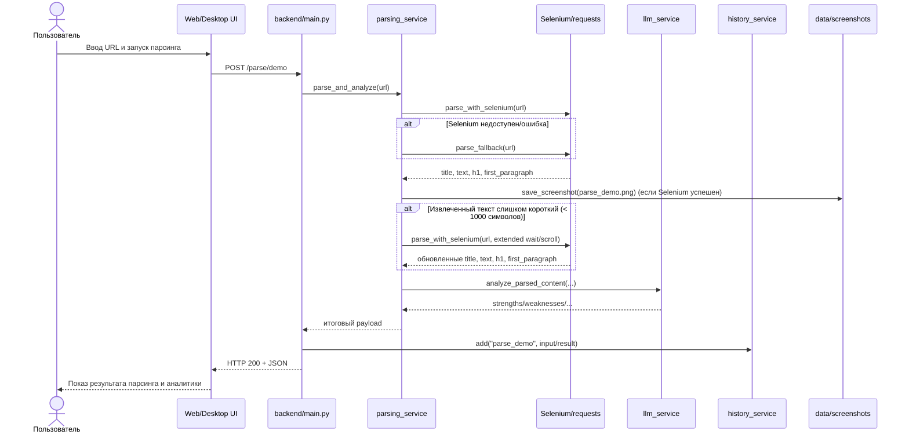
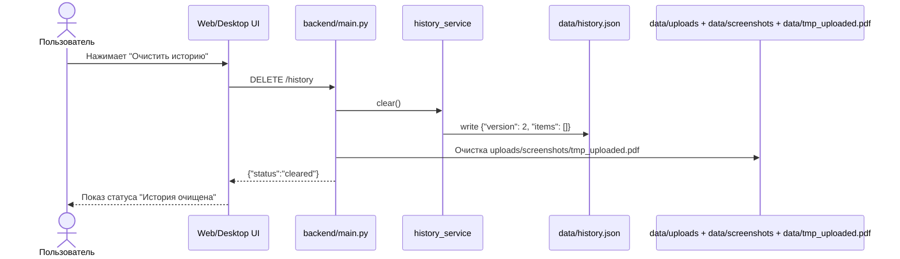
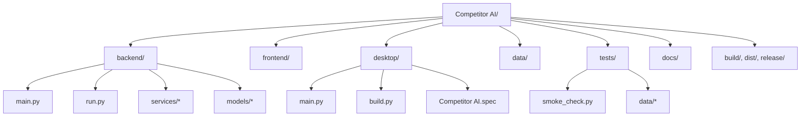
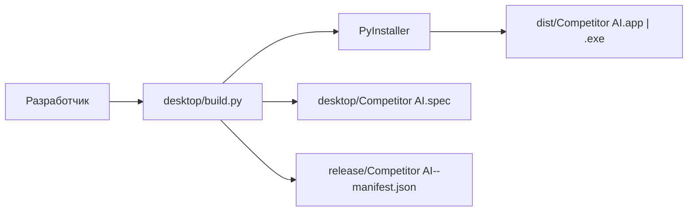

# Архитектура

> **Проект:** Competitor AI  
> **Версия:** 1.0  
> **Дата актуализации:** 2026-04-22

## Оглавление
- [1. Цель документа](#1-цель-документа)
- [2. Область применения](#2-область-применения)
- [3. Контекст системы](#3-контекст-системы)
- [4. Логическая архитектура компонентов](#4-логическая-архитектура-компонентов)
- [5. Ключевые runtime-потоки](#5-ключевые-runtime-потоки)
- [6. Физическая структура (репозиторий)](#6-физическая-структура-репозиторий)
- [7. Архитектура сборки desktop](#7-архитектура-сборки-desktop)
- [8. Принятые архитектурные решения](#8-принятые-архитектурные-решения)
- [9. Ограничения архитектуры](#9-ограничения-архитектуры)
- [10. Связанные документы](#10-связанные-документы)

## 1. Цель документа
Описать архитектурные решения проекта Competitor AI: границы системы, ключевые компоненты, взаимодействия и контур сборки desktop-приложения.

## 2. Область применения
Документ применяется командами backend/frontend/desktop разработки, DevOps и QA для согласования технической структуры и ключевых архитектурных ограничений.

## 3. Контекст системы

## 4. Логическая архитектура компонентов

## 5. Ключевые runtime-потоки

### 5.1 Sequence: анализ изображения

### 5.2 Sequence: парсинг сайта

### 5.3 Sequence: очистка истории

## 6. Физическая структура (репозиторий)

## 7. Архитектура сборки desktop

## 8. Принятые архитектурные решения
- **Разделение по слоям:** `backend`, `frontend`, `desktop`, `tests`.
- **Единый backend-контур:** web и desktop используют одинаковые API-эндпоинты.
- **File-based runtime storage:** история и загруженные файлы хранятся локально в `data/`.
- **Устойчивость парсинга:** Selenium-first с fallback на requests/BeautifulSoup.
- **Явная очистка runtime-данных:** `DELETE /history` очищает и историю, и временные файлы.

## 9. Ограничения архитектуры
- Нет выделенной БД; история хранится в JSON-файле.
- Desktop зависит от доступности backend-процесса.
- Качество ответов зависит от внешнего LLM-провайдера.
- Кросс-компиляция desktop-сборок не поддерживается (сборка по целевой ОС).

## 10. Связанные документы
- `docs/Техническое задание.md`
- `docs/Интерфейсы и сценарии.md`
- `docs/Требования к автоматическому тестированию.md`
- `README.md`
