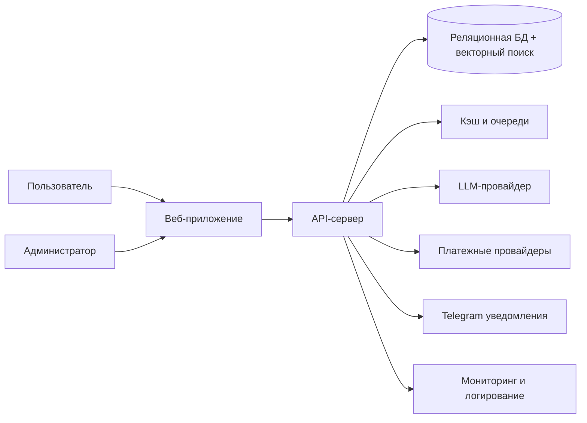

и # Системный дизайн (публичная версия)

## Оглавление
- [1. Назначение документа](#1-назначение-документа)
- [2. Общие принципы](#2-общие-принципы)
- [3. Компоненты системы](#3-компоненты-системы)
- [4. Поток данных](#4-поток-данных)
- [5. Технологический стек](#5-технологический-стек)
- [6. Надежность и масштабируемость](#6-надежность-и-масштабируемость)
- [7. Безопасность](#7-безопасность)
- [8. Аналитический контур и AI-аналитики](#8-аналитический-контур-и-ai-аналитики)
- [9. Диаграмма компонентов (упрощенно)](#9-диаграмма-компонентов-упрощенно)
- [10. Ограничения публичной версии](#10-ограничения-публичной-версии)

## 1. Назначение документа
Документ описывает архитектуру `Prompt Assistant` на уровне ключевых компонентов, потоков данных и инженерных принципов без раскрытия внутренних эксплуатационных деталей.

## 2. Общие принципы
- **Клиент-серверная архитектура**: пользовательский интерфейс обращается к API, бизнес-логика сосредоточена на стороне сервера.
- **Синхронные и асинхронные процессы**: пользовательские сценарии выполняются в онлайне, сервисные операции выносятся в фоновые задачи.
- **Интеграционный подход**: система проектируется как расширяемая платформа для AI, платежей и уведомлений.
- **Наблюдаемость по умолчанию**: ключевые процессы и метрики доступны для операционного контроля.

## 3. Компоненты системы
### 3.1 Веб-приложение (Frontend)
- интерфейсы для пользователей и администраторов;
- сценарии генерации, библиотеки, биллинга, аналитики и поддержки;
- взаимодействие с API по защищенному каналу.

### 3.2 API-сервер (Backend)
- реализует бизнес-логику и оркестрацию AI-сценариев;
- управляет авторизацией, правами, тарифами и платежами;
- обеспечивает контракты для пользовательского и административного контуров.

### 3.3 Хранилище данных
- реляционная СУБД для транзакционных данных;
- поддержка векторного поиска для семантического поиска промптов и документов;
- структурированное хранение пользовательских и операционных сущностей.

### 3.4 Кэш и очереди
- ускорение часто используемых операций;
- выполнение фоновых и сервисных задач;
- снижение нагрузки на основные транзакционные контуры.

### 3.5 Внешние интеграции
- LLM-провайдер для генерации и анализа;
- платежные провайдеры для подписок и пополнений;
- Telegram для уведомлений и операционной коммуникации.

### 3.6 Административная аналитическая подсистема
- внутреннее хранилище данных для сбора операционных и продуктовых показателей;
- слой расчета агрегатов и производных метрик;
- единый аналитический контур для принятия управленческих решений.

## 4. Поток данных
1. Пользователь инициирует действие в интерфейсе (например, генерацию промпта).
2. Frontend отправляет запрос в API.
3. API валидирует запрос, проверяет права, лимиты и контекст тарифа.
4. Для AI-сценариев API обращается к LLM-провайдеру и формирует итоговый результат.
5. Результат сохраняется в хранилище и возвращается пользователю.
6. Сервисные операции (уведомления, аналитика, периодические проверки) обрабатываются в фоновых задачах.

## 5. Технологический стек
- **Frontend**: React, TypeScript, Vite, Tailwind CSS.
- **Backend**: Python, FastAPI, SQLAlchemy.
- **Database**: PostgreSQL + `pgvector`.
- **Cache/Queue**: Valkey (Redis-совместимый).
- **Observability**: Prometheus, Grafana, Loki.
- **Integrations**: polza.ai, YooKassa, Robokassa, Telegram Bot API.

Выбор стека обусловлен сочетанием производительности, зрелости экосистемы и удобства развития AI-интеграций в продукте.

## 6. Надежность и масштабируемость
- модульное разделение контуров (клиентский, административный, интеграционный);
- горизонтальное масштабирование stateless-компонентов;
- изоляция фоновых задач от пользовательского пути;
- мониторинг и оперативная диагностика ключевых сервисов.

## 7. Безопасность
- обязательное использование HTTPS;
- защищенное хранение паролей и чувствительных данных;
- контроль входных данных и защита от типовых веб-угроз;
- соответствие требованиям 152-ФЗ, включая механизмы согласий и удаления данных.

## 8. Аналитический контур и AI-аналитики
В административной части системы реализован внутренний аналитический контур:
- данные собираются в едином хранилище;
- показатели собиратюся, а агрегаты рассчитываются по трем направлениям:
  - маркетинговые показатели,
  - продуктовые показатели,
  - технические показатели.

На базе этого контура реализованы:
- три специализированных дашборда (маркетинговый, продуктовый, технический);
- три AI-аналитики, которые:
  - отвечают на вопросы по текущим метрикам и динамике,
  - рекомендуют мероприятия по развитию технической инфраструктуры,
  - рекомендуют мероприятия по функциональному развитию продукта,
  - рекомендуют мероприятия по продвижению продукта на рынке.

## 9. Диаграмма компонентов (упрощенно)

## 10. Ограничения публичной версии
Подробное описание инфраструктуры, развёртывания, конфигураций, политик доступа и внутренних процессов приведено во внутренней документации и не публикуется в открытом доступе.
